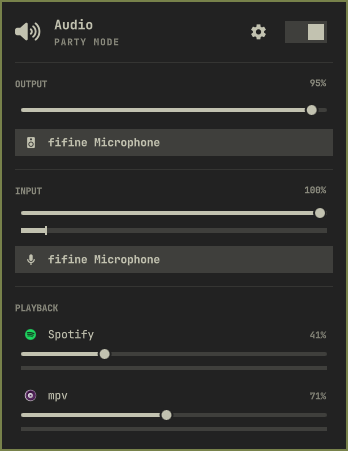
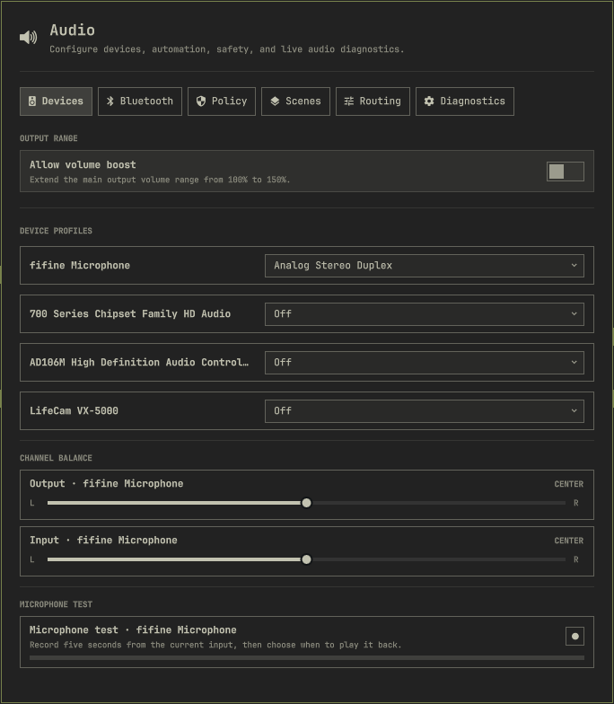

# Advanced Audio Control for Omarchy

Advanced Audio Control rebuilds Omarchy's audio controls around a shared **Rust
service**, with the familiar **Quickshell/QML** quick mixer and advanced panel.
It combines device configuration, application routing, microphone tools and
saved audio setups with one backend coordinating changes from both views.

Derived from Omarchy's built-in audio widget, it integrates with Omarchy's plugin
system, bar, keyboard shortcuts and theme. PipeWire and WirePlumber continue to
handle audio processing and session policy.

> **Rust 0.9 development preview.** This branch contains the architectural
> upgrade. The published default branch still provides the 0.8 release; the
> standard plugin installation follows that branch. See [Development](#development)
> to build a complete Rust candidate.

## Screenshots

<table>
  <tr>
    <th>Quick mixer</th>
    <th>Advanced panel</th>
  </tr>
  <tr>
    <td valign="top"><a href="screenshot-mixer.png"></a></td>
    <td valign="top"><a href="screenshot-advanced.png"></a></td>
  </tr>
</table>

## Architecture

Both views share one service, one view of persisted settings and one coordinator
for audio changes. A scene or profile transition stays under the coordinator's
ownership until verification and recovery finish. Device commands carry live
identities so a disconnected device cannot be confused with a replacement.

| Layer | Responsibility |
| --- | --- |
| Quickshell / QML | Quick mixer, advanced panel, keyboard navigation, theme and native level meters. |
| Rust service | Native PipeWire graph observation, volume controls, persistence, transaction coordination, routing automation, microphone jobs and shared diagnostics. |
| PipeWire / WirePlumber | Audio transport and processing, device/session management and persistent policy. |

Graph and configuration changes are observed through events. Diagnostic samples
are requested by visible views and shared for five seconds. Requests and state
messages have size limits and deadlines; a lost reply never automatically
replays an audio change.

Profiles, ports, routing, output groups, policy and diagnostic collection still
use guarded helper adapters called by the Rust service. Their coordination has
moved into the backend; replacing each adapter's implementation is ongoing.

Packaged candidates include the backend executable. Omarchy starts it with the
plugin. Once clients disconnect, the service finishes accepted work and exits
when unused. A complete package needs no compiler or separately enabled service.
Each build has matching QML and backend identities, checked before controls are
enabled, so an interrupted update cannot silently mix releases.

## Features

- **Mixing:** output, input and per-application volume; mute; stereo balance;
  live meters and application icons. Device and application playback controls stop at
  100%; enabling output boost extends both to 150%. Turning boost off restores
  boosted playback applications to 100%.
- **Devices and Bluetooth:** profiles, ports and codecs, communication-mode
  switching, and quality or latency preferences where supported.
- **Persistent routing:** pin playback and recording applications to devices,
  create rules before applications start, and choose when to follow defaults.
  Device aliases, favorites and visibility controls keep the mixer organized.
- **Output groups:** combine two to eight outputs into one destination for the
  default device or individual applications, with per-member volume controls.
- **Scenes:** save defaults, volumes, balance, ports and profiles, then restore
  a setup from the quick mixer or advanced panel.
- **Microphone tools:** recording-app badge and hover list, optional capture
  notifications that respect Do Not Disturb, peak/clipping indicators, and a
  private five-second record-and-playback test.
- **Safety policies:** supported WirePlumber controls for mono audio, output
  loss, disconnect protection, HDMI detection and starting volumes.
- **Diagnostics:** service health, graph rate and quantum, DSP load, XRUN/error
  counters, device formats and active routes, plus speaker identification,
  support reports and confirmed Omarchy audio recovery.

## Everyday controls

| Action | Control |
| --- | --- |
| Open the quick mixer | Left-click the audio icon or press `Super+Ctrl+A`. |
| Adjust output volume | Scroll over the audio icon. |
| Toggle microphone mute | Middle-click the audio icon. |
| Toggle all-audio mute | Right-click the audio icon. |
| See microphone users | Hover over the audio icon. |
| Open the advanced panel | Select the mixer gear or the optional **Setup > Audio** entry. |

**Follow default output** clears an application's remembered destination.
**Always use** pins it across stream and application restarts. Recording
applications can likewise stay pinned to a microphone when the default changes.

The optional [Advanced Bluetooth Audio](https://github.com/ssupt/omarchy-bluetooth-audio)
companion adds codec controls to Omarchy's Bluetooth panel. Both plugins share
codec and preferred-device choices through `audio-preferences.json`.

## Installation

Requires **Omarchy Quattro on x86_64 Linux**, PipeWire and WirePlumber. The plugin
uses the usual Omarchy audio and desktop tools: `pactl`, `wpctl`, `pw-metadata`,
`pw-dump`, `pw-top`, `pw-record`, `pw-play`, `speaker-test`, `systemctl`, `jq`,
`hyprctl`, `timeout`, `flock`, `wl-copy`, and `notify-send` for notifications.
Routine audio controls run as your user.

Install the published version through Omarchy:

```bash
omarchy plugin add https://github.com/ssupt/omarchy-audio-control.git --enable
```

This follows the [published default branch](https://github.com/ssupt/omarchy-audio-control/tree/main),
currently 0.8.0. The Rust development candidate described here is built using
[the instructions below](#development).

Optionally add **Setup > Audio** to Omarchy's menu:

```bash
~/.config/omarchy/plugins/ssupt.audio-control/scripts/audio-menu-entry install
```

The enabled plugin replaces the built-in audio widget. Disabling or removing it
restores Omarchy's original widget.

<details>
<summary>Update or remove</summary>

```bash
omarchy plugin update ssupt.audio-control
```

To remove the menu entry and plugin:

```bash
~/.config/omarchy/plugins/ssupt.audio-control/scripts/audio-menu-entry remove
omarchy plugin remove ssupt.audio-control
```

</details>

## Saved settings and behavior

Settings remain under `~/.config/omarchy` (or `$XDG_CONFIG_HOME/omarchy`) using
the existing filenames and schemas. Dotfiles-managed directory symlinks are
supported.

| File | Contents |
| --- | --- |
| `audio-control.json` | Output boost and capture notifications. |
| `audio-preferences.json` | Preferred devices and Bluetooth profile choices; shared with the companion. |
| `audio-rules.json` | Application rules, device aliases/preferences and output groups. |
| `audio-scenes.json` | Saved audio scenes. |

The microphone test starts only on request and keeps its clip in service memory.
Playback is explicit; stopping early keeps the recorded portion. Discarding the
clip or closing the advanced panel removes it. Scenes skip absent devices,
report their results, leave output mutes alone and never power cards off.

Output groups retain their definitions when a member disconnects. A selected
incomplete group moves following applications to a surviving member and is
restored when all members return. Member sliders change the physical device
volumes. Outputs with independent clocks, especially Bluetooth, can drift.

Diagnostics refresh only while visible. Support reports omit logs, account
details, configuration files and internal device names. Speaker identification
runs a finite, stoppable pass. Audio recovery requires confirmation and opens
Omarchy's visible recovery terminal, including any USB-reset authorization.

## Validation and resource use

Tests cover native graph changes, shared transactions, file safety, bounded
protocols, recording cancellation, diagnostics, and plugin install/update/
rollback/removal. Local USB microphone testing confirmed microphone-test
feedback and prompt removal/reappearance in both views: unplugging removed the
input and showed Dummy Output; reconnecting restored the devices. Bluetooth,
group-member loss and physical recording-interruption scenarios still need
broader hardware coverage before public rollout.

A local comparison against 0.8.0 used two rounds of 20-second scenarios on a
private dummy audio graph. With the advanced window open:

| Measurement | 0.8.0 | Rust dev.7 |
| --- | ---: | ---: |
| CPU, percentage of one core | 3.24% | 0.005% |
| Helper launches per 20 seconds | 24 | 0 |
| Process memory, PSS | 60.7 MiB | 68.7 MiB |

The measurement includes the test Quickshell process, backend and helpers.
Other desktop activity remained active; these are local observations. Rust
used about 8 MiB more memory in this scenario. Independently observed volume
changes had a 1 ms median in both versions, at 1 ms clock resolution; this does
not measure physical audio latency. The [benchmark harness](test/integration/benchmark.py)
contains the reproducible procedure.

A later dev.7 → dev.8 comparison on the current desktop measured **1.8 MiB less
PSS with the advanced window open** (78.3 → 76.5 MiB), across two alternating
15-second runs. Idle memory was unchanged. Dev.8 defers inactive-tab lists until
first use and avoids redundant diagnostic JSON copies; visited tabs retain their
controls. These observations use a newer environment than the 0.8.0 comparison
above and should not be combined into a single before/after result.

## Development

Building requires Rust/Cargo **1.85 or newer**, libclang, pkg-config and PipeWire
development headers. Build a complete candidate outside the live plugin checkout:

```bash
./test/all
python3 packaging/build-release.py --output /tmp/omarchy-audio-release
python3 packaging/build-release.py --check /tmp/omarchy-audio-release
omarchy-plugin-validate /tmp/omarchy-audio-release
```

The candidate contains the executable, matching sources, generated QML and
manifest. A source checkout alone is not an installable Rust release. Edit
`qml/` and `packaging/manifest.json`; the builder produces `runtime/<buildId>/qml/`,
the root manifest and backend metadata. Ship those files together. Editing
source QML alone does not change an already packaged UI.

<details>
<summary>Source layout and integration checks</summary>

```text
backend/src/       Native audio, service, storage, protocol and job supervision
qml/
  panels/          Quick mixer and advanced panel
  core/            Service client, commands, model and runtime paths
  components/      Shared rows, icons and dropdowns
  devices/         Device profiles, ports and preferences
  routing/         Application rules and output groups
  policy/          WirePlumber policy controls
  scenes/          Saved-scene controls
  microphone/      Microphone test controls
  diagnostics/     Diagnostics view and controller
scripts/           Guarded adapters and desktop integration
packaging/         Release builder and canonical manifest
test/              Protocol, helper and integration checks
```

```bash
python3 /tmp/omarchy-audio-release/test/integration/runtime.py \
  /tmp/omarchy-audio-release/bin/omarchy-audio-service
python3 /tmp/omarchy-audio-release/test/integration/deadlines.py
python3 /tmp/omarchy-audio-release/test/integration/microphone.py \
  /tmp/omarchy-audio-release/bin/omarchy-audio-service
python3 /tmp/omarchy-audio-release/test/integration/diagnostics.py \
  /tmp/omarchy-audio-release/bin/omarchy-audio-service
python3 /tmp/omarchy-audio-release/test/integration/upgrade.py \
  /tmp/omarchy-audio-release /absolute/previous-candidate
```

QML integration requires Quickshell, Weston and the Omarchy shell. Microphone
integration records synthetic samples using real recorder/player processes in a
private PipeWire/WirePlumber/D-Bus graph. It does not capture a real microphone.

To reproduce the resource and volume-response comparison:

```bash
python3 test/integration/benchmark.py /absolute/legacy-checkout \
  /tmp/omarchy-audio-release --output /tmp/audio-benchmark.json
```

Add `--latency-only --samples 100 --rounds 2` to measure only independently
observed volume responses. The benchmark also requires PipeWire/Pulse,
WirePlumber and a systemd user manager with cgroup accounting.

</details>

Detailed architecture notes, hardware checklists and development reports are
maintained outside this repository and are excluded from release packages.

## License

[MIT](LICENSE), matching the original Omarchy audio widget.
More plugins: [omarchy-plugins](https://github.com/ssupt/omarchy-plugins).
