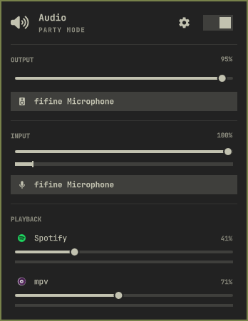
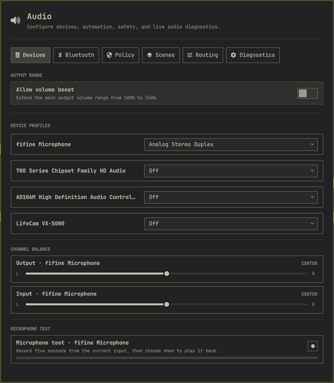

# Advanced Audio Control for Omarchy

Advanced Audio Control brings persistent routing, saved setups, and device
controls to Omarchy's audio panel.

Choose which output or microphone each application uses, play through several
outputs together, and restore saved device settings. Keep Omarchy's familiar
quick mixer for everyday volume changes, with an advanced window for profiles,
Bluetooth modes, microphone testing, and diagnostics.

Useful when you regularly switch between speakers, headphones, USB audio
devices, or different setups for music and calls.

## What it adds to Omarchy

Compared with the [stock Omarchy Quattro audio panel](https://github.com/omacom/omarchy/blob/c5b4db77d68e7fbce5cf11120712ea322557e967/shell/plugins/panels/audio/Panel.qml),
checked **27 September 2026**:

| Stock panel | Advanced Audio Control adds |
| --- | --- |
| Master, microphone, and application volume; output selection | A quick mixer plus persistent output and microphone choices for each application |
| Current device controls | Saved scenes for defaults, volume, balance, ports, and profiles |
| One selected output | Groups of two to eight outputs, each with its own volume control |

For example:

- Send music to the speakers while a call uses headphones: set each application's
  output to **Always use** its chosen device.
- Save a **Desk** scene with USB speakers and a desk microphone, and a
  **Headphones** scene for private listening; restore either setup from the
  advanced window.
- With [Advanced Bluetooth Audio](https://github.com/ssupt/omarchy-bluetooth-audio),
  let a headset reconnect without replacing your microphone: choose **Manual**
  or **Output** under **Audio on connect** for that device.

## Screenshots

<table>
  <tr><th>Quick mixer</th><th>Advanced window</th></tr>
  <tr>
    <td valign="top"><a href="screenshot-mixer.png"></a></td>
    <td valign="top"><a href="screenshot-advanced.png"></a></td>
  </tr>
</table>

## Everyday controls

| Action | Control |
| --- | --- |
| Open mixer | Left-click the audio icon or press `Super+Ctrl+A` |
| Change output volume | Scroll over the audio icon |
| Mute microphone | Middle-click the audio icon |
| Mute all audio | Right-click the audio icon |
| See microphone users | Hover over the audio icon |
| Open advanced window | Select the mixer gear |

For an application, **Follow default output** clears a saved destination;
**Always use** keeps the chosen device across restarts. Recording applications
can also stay pinned to a microphone. The advanced window also offers device
aliases and favorites, stereo balance, supported Bluetooth modes, microphone
activity and a five-second record-and-playback test, speaker identification,
audio recovery, and diagnostics.

An output group can drift when its devices use separate clocks, especially with
Bluetooth. Microphone tests start only when requested; clips stay in memory
until discarded or until the advanced window closes.

## Install

Requires **Omarchy Quattro on x86_64 Linux**, PipeWire and WirePlumber, with
Omarchy's usual audio and desktop tools. Installation needs no Rust toolchain.

```bash
omarchy plugin add https://github.com/ssupt/omarchy-audio-control.git --enable
```

Update or remove it:

```bash
omarchy plugin update ssupt.audio-control
omarchy plugin remove ssupt.audio-control
```

Disabling or removing the plugin restores Omarchy's built-in audio widget.
To add **Setup > Audio** to the menu, run:

```bash
~/.config/omarchy/plugins/ssupt.audio-control/scripts/audio-menu-entry install
```

Use the same helper with `remove` before removing the plugin.

## Saved settings

Settings live under `~/.config/omarchy` (or `$XDG_CONFIG_HOME/omarchy`).
Existing files and supported schemas are preserved.

| File | What it remembers |
| --- | --- |
| `audio-control.json` | Output boost and capture notifications |
| `audio-preferences.json` | Preferred devices and Bluetooth profiles, shared with the Bluetooth companion |
| `audio-rules.json` | Application rules, device preferences, and output groups |
| `audio-scenes.json` | Saved scenes |

## Service architecture

The interface uses Quickshell/QML. A Rust service keeps saved choices and
in-progress changes alive when a panel closes or reloads. It coordinates audio
changes with PipeWire and WirePlumber, then reports whether each requested
change was confirmed, rejected, or left uncertain. The service controls audio;
PipeWire still carries and mixes the sound.

A controlled test against 0.8.1 measured over 99% less CPU with the advanced
window open, using about 3 MiB more memory.

If your Omarchy configuration directory is a symlink, restart the audio service
after retargeting it so file watches follow the new location.

## Contributing

Edit `qml/`, `backend/src/`, and `scripts/`; `runtime/` contains generated QML.
Builds require Rust/Cargo **1.85+**, libclang, pkg-config, and PipeWire and
libpulse headers. Node.js, Python, jq, and Qt/Quickshell run the tests.

```bash
./test/all
python3 packaging/build-release.py --output /tmp/omarchy-audio-release
python3 packaging/build-release.py --check /tmp/omarchy-audio-release
omarchy-plugin-validate /tmp/omarchy-audio-release
```

Use a fresh directory outside the live plugin for each candidate. Commit the
matching binary, release metadata, manifest, and generated runtime when changing
runtime sources. CI also runs native audio, lifecycle, and upgrade tests under
`test/integration/` with private audio devices and configuration.

For testing outside the shell, `scripts/audio-rust-backend install` and
`uninstall` manage an optional systemd user service.

The Bluetooth companion calls `default.compat` with a node ID and name; the
service verifies the live endpoint and reports the outcome. Both plugins share
`audio-preferences.json`, while compatibility helpers support older companions.
Coordinate releases when changing that shared contract.

[MIT license](LICENSE), matching Omarchy's original audio widget.
More plugins: [omarchy-plugins](https://github.com/ssupt/omarchy-plugins).
